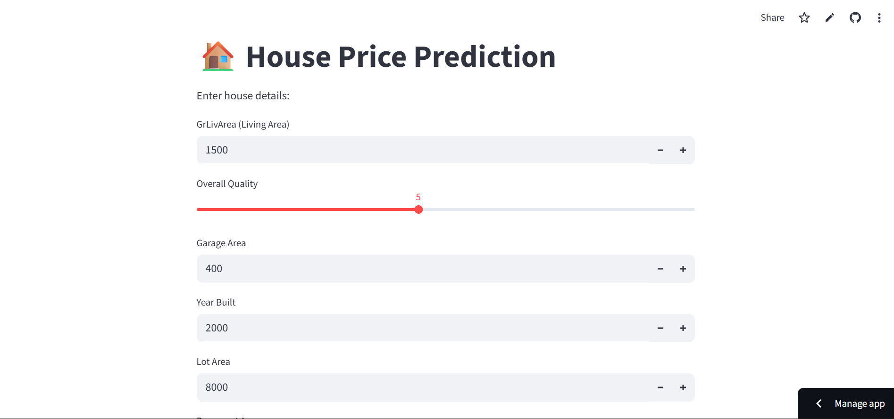
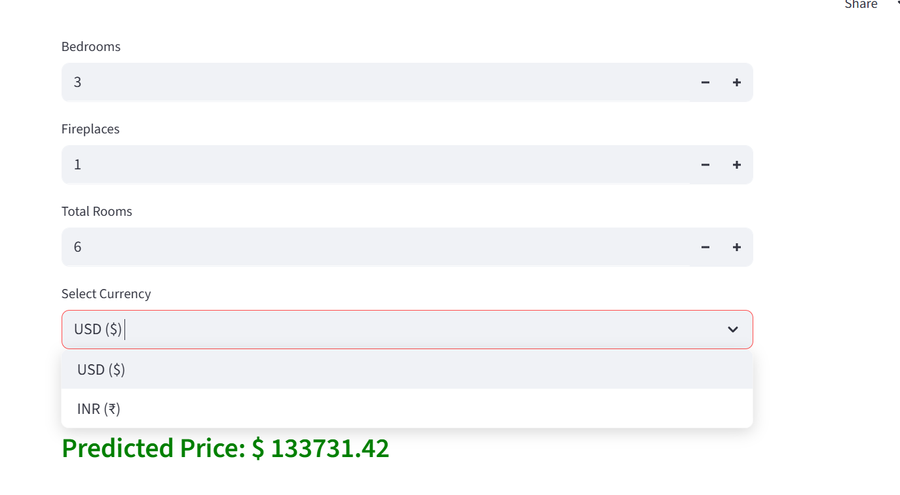

🏠 House Price Prediction – End to End ML Web App

🌐 Live App

👉 https://2zfehqmwak3s3cu6k5lgas.streamlit.app/

## Business Problem

Real estate prices depend on many factors like area, quality, location, rooms, etc.
Manually estimating price is difficult and subjective.

This project builds a Machine Learning based prediction system that:

Takes house details from user

Processes them using trained model

Predicts accurate house price instantly

### Model Details

Algorithm: Random Forest Regressor

Target: Sale Price

Performance:

Metric	Value
RMSE	28,767
R² Score	0.89

Model trained on structured housing dataset with proper preprocessing and feature engineering.

## 🧠 How Model Was Trained

1. **Dataset**
- Used House Prices dataset with numerical features like:
  - GrLivArea  
  - OverallQual  
  - GarageArea  
  - YearBuilt  
  - LotArea  

2. **Preprocessing**
- Selected important numerical features  
- Handled missing values  
- Split data into Train/Test  
- Feature scaling applied

3. **Model Building**
- Algorithm: Linear Regression  
- Training process:
  - Train-test split (80-20)
  - Model fitted on training data
  - Evaluated using RMSE and R² score

4. **Model Saving**
- Model saved using `joblib`
- Columns saved for consistent prediction

🛠 Tech Stack

Python

Scikit-learn

Pandas

Joblib

Streamlit

Git & GitHub

📁 Project Structure
house-price-project/
│
├── data/                     # Dataset
├── notebooks/                # Training notebooks
│   ├── eda.ipynb
│   ├── final_model.pkl
│   └── train_columns.pkl
│
├── app.py                    # Streamlit app
├── requirements.txt
└── README.md

⚙ How to Run Locally

Clone repo

git clone https://github.com/may7jha/House-Price-Prediction.git
cd House-Price-Prediction

Create virtual environment

python -m venv venv
source venv/bin/activate   # Windows: venv\Scripts\activate

Install dependencies

pip install -r requirements.txt

Run app

streamlit run app.py

🔁 Prediction Pipeline

User enters house details

Input converted to dataframe

Columns aligned with training

Model predicts price

Result shown on UI

## 🖼 Application Screenshots

### 1. Input Dashboard

### 2. Entering Details

### 3. Prediction Result

📈 Future Improvements

Add location feature

Add more models (XGBoost, LightGBM)

Add visualization dashboard

User authentication

API version using FastAPI

👤 Author

Mayank Jha
Aspiring Data Scientist
GitHub: https://github.com/may7jha

⭐ If you like this project, give it a star on GitHub!
